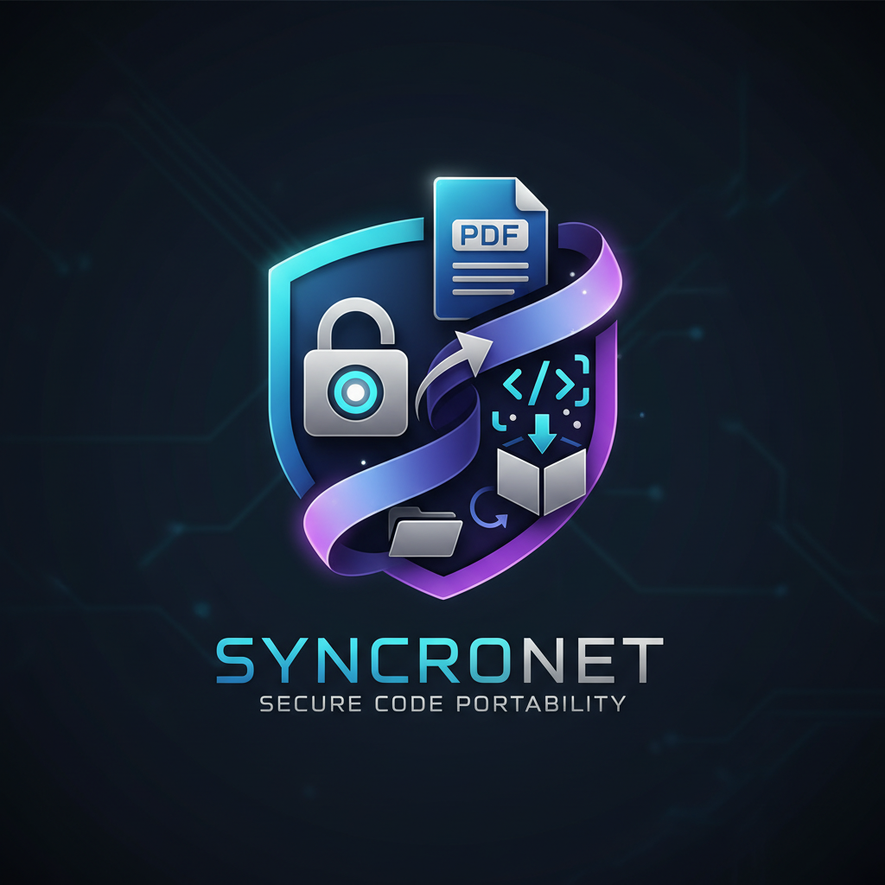

# PySyncroNet - Advanced PDF Project Manager

## Descrizione del Progetto

**PySyncroNet** è un software avanzato per la **condivisione e archiviazione sicura di progetti software**. Grazie alla sua architettura innovativa, converte intere cartelle contenenti codice sorgente in un unico **documento PDF leggibile e portabile**, che può successivamente essere **ricostruito integralmente** nella struttura originale.

Il formato PDF non solo garantisce sicurezza e compatibilità, ma offre anche un potente vantaggio: i PDF generati possono essere **utilizzati come input per modelli di Intelligenza Artificiale (IA)**, facilitando analisi semantiche, code review automatizzate e training di modelli NLP sul codice.

<p align="center">
  
</p>
---

## Funzionalità Principali

* ✨ **Conversione Progetto → PDF**
  Crea un documento PDF dettagliato da una cartella di progetto, includendo codice sorgente, configurazioni e struttura gerarchica, con numerazione di riga e conservazione dell'indentazione.

* 🔄 **Ricostruzione Progetto → Cartella**
  Ricrea fedelmente un progetto originale a partire dal PDF generato, mantenendo nomi file, indentazioni e struttura.

* ⚙️ **Gestione Esclusioni Avanzata**
  Possibilità di escludere directory (es. *venv*, *.git*, *node_modules*), file specifici o estensioni binarie non desiderate.

* 🔍 **Interfaccia Grafica Moderna (GUI)**
  Basata su **Tkinter**, offre un tema scuro, schede multiple (Creazione PDF, Ricostruzione, Esclusioni, Impostazioni) e un sistema di log interattivo.

* ⏳ **Elaborazioni in Background**
  Le operazioni pesanti vengono eseguite tramite *threading*, mantenendo la GUI reattiva.

* 🔒 **Sicurezza e IA-Ready**
  Tutti i file binari vengono esclusi automaticamente, rendendo i PDF non solo sicuri da condividere, ma anche **pronti per essere analizzati da modelli di IA** (LLM, chatbot, code analyzers, ecc.).

---

## Tecnologie Utilizzate

* **Python 3.8+**
* **Tkinter** per l'interfaccia grafica
* **FPDF** e **PyPDF2** per la gestione dei PDF
* **Threading**, **pathlib**, **os**, **re** per la logica applicativa

---

## Installazione

1. Clonare il repository:

   ```bash
   git clone https://github.com/Sigmanih/PySyncroNet.git
   cd PySyncroNet
   ```
2. Installare ed avviare un virtual environment [venv] (facoltativo) 
   ```bash
    python -m venv venv
    .\venv\Scripts\activate
   ```
3. Installare le dipendenze:

   ```bash
   pip install -r requirements.txt
   ```
4. Avviare l'applicazione:

   ```bash
   python main.py
   ```

---

## Utilizzo

### 🔄 Creazione PDF

1. Seleziona la cartella del progetto
2. Imposta (opzionalmente) le esclusioni
3. Premi **“Crea PDF”** per generare la documentazione del progetto


### 🔄 Ricostruzione da PDF

1. Seleziona un PDF generato in precedenza
2. Scegli la cartella di output
3. Premi **“Ricrea Progetto”** per ricostruire la struttura


---

## Integrazione con l’Intelligenza Artificiale

L’uso del formato PDF come output principale non è solo una scelta di sicurezza, ma anche strategica per l’**integrazione con strumenti di IA**.
I PDF generati da PySyncroNet:

* Sono **leggibili dai modelli linguistici** (come GPT o Claude) per analisi automatizzate del codice;
* Consentono **code review, audit e refactoring assistiti da IA**;
* Possono essere usati come dataset strutturato per **training o fine-tuning** di modelli basati su codice sorgente.

---

## Vantaggi Principali

* Eliminazione del rischio di malware o file eseguibili malevoli
* Compatibilità universale del formato PDF
* Ottimale per archiviazione, documentazione e AI analysis
* Ricostruzione fedele e verificabile del progetto originale

---

## Licenza

Distribuito sotto licenza **MIT**.
Consulta il file `LICENSE` per dettagli.

---

## Autore

**PySyncroNet** – sviluppato da Sigmanih
Versione: **3.1 (AI-Enhanced Edition)**
Data: Novembre 2025


